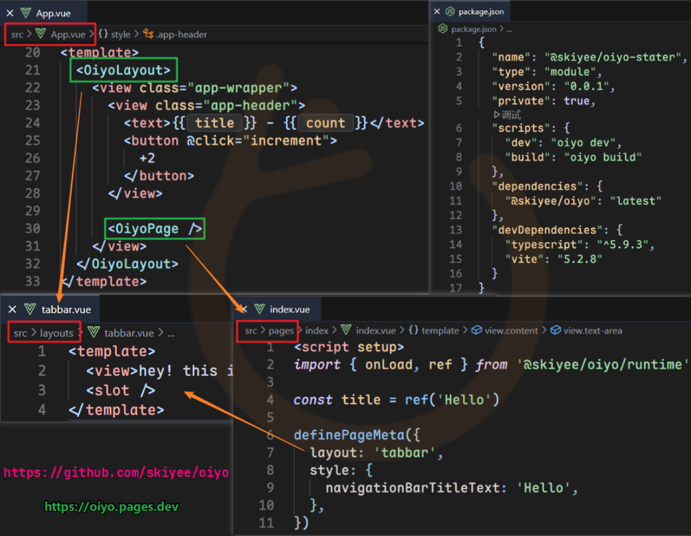

  <a href="https://oiyo.js.org/">
    <picture>
      
    </picture>
  </a>

   <h1>oiyo</h1>

Oiyo 是以融合AI协作，提升开发体验，降低心智成本为三大理念的 UniApp 增强型工程框架

通过使用约定和主观的工程结构来解决以往重复的任务流程，让开发者得以专注业务的功能开发，其拥有：

- 根上下文
- 布局系统
- 自动路由
- 页面元信息声明
- 跳转守卫
- 主观工程结构
- 稳定底层依赖版本
- 一站式团队服务

  <strong> (点击展开) 🫣 Oiyo 核心功能代码先知图</strong>

 
<a href="https://oiyo.js.org" target="_blank">
  <picture>
    
  </picture>
</a>

## 📖 文档

访问 [OIYO 官方文档](https://oiyo.js.org)

## 💝 联系方式

- 作者: `skiyee(sKy)`
- 微信/QQ: `319619193`
- 邮箱: `319619193@qq.com`

## ⛽ 支持范畴

### 免费支持

- 文档和标准示例
- 通用使用问题
- 提供最小复现后的框架级缺陷反馈

### 商业支持

- 协助项目接入
- 老项目迁移
- 页面结构改造
- 版本兼容排查
- 编译、HMR、构建异常定位
- 权限与中间件方案接入
- 远程协助与定制开发

## ⚖️ 许可

[oiyo 商业软件许可协议](./LICENSE) © 2026-PRESENT [sKy (skiyee)](https://github.com/skiyee)
