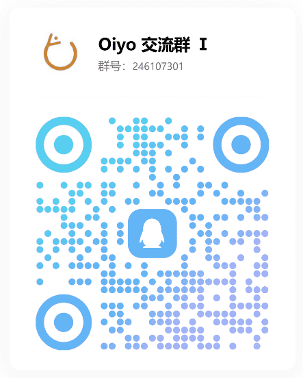

<div align="center">
  <a href="https://oiyo.js.org/">
    <picture>
      
    </picture>
  </a>

   <h1>oiyo</h1>
</div>

[](https://www.github.com/skiyee/oiyo)
[](https://www.github.com/skiyee/oiyo)
[](https://oiyo.js.org)
[](https://www.github.com/skiyee/oiyo/blob/main/LICENSE)

Oiyo 是以融合AI协作，提升开发体验，降低心智成本为三大理念的 UniApp 增强型工程框架

通过使用约定和主观的工程结构来解决以往重复的任务流程，让开发者得以专注业务的功能开发，其拥有：

- 根上下文
- 布局系统
- 自动路由
- 页面元信息声明
- 跳转守卫
- 自动导入
- 主观工程结构
- 稳定底层依赖版本
- 类型提示系统
- 一站式团队服务

## 🎉 开始

通过以下命令交互式的创建一个起手项目：

```bash
pnpm create oiyo@latest
```

| 分支                                                                         | 命令                                    |
|------------------------------------------------------------------------------|-----------------------------------------|
| [main](https://github.com/skiyee/oiyo/tree/main) (最简模板)                  | pnpm create oiyo --preset=minimal       |
| [unibest](https://github.com/skiyee/oiyo/tree/unibest) (Oiyo 赋能版)         | pnpm create oiyo --template=unibest     |
| [wot-starter](https://github.com/skiyee/oiyo/tree/wot-starter) (Oiyo 赋能版) | pnpm create oiyo --template=wot-starter |

## 📖 文档

强烈建议阅读文档，进一步挖掘该框架更多的功能！

Oiyo 官方文档: [oiyo.js.org/docs](https://oiyo.js.org/docs)

## 💞 社群

我们提供社群，让每一个开发者都能参与最直接的交流：

- QQ群：[246107301](https://qm.qq.com/q/iVPctWtKQS)

  

## 💝 关于

作者: **sky [Skiyee]** - 切图仔、全干攻城猫、轮子砖家

| 平台      | 链接                                             |
|-----------|--------------------------------------------------|
| 🌐 官网   | [oiyo.js.org](https://oiyo.js.org/)              |
| 🐧 QQ     | [319619193](https://oiyo.js.org/)                |
| 🗻 掘金   | [skiyee](https://juejin.cn/user/300614247782265) |
| 💬 公众号 | 微信搜「天空言码」或扫码关注 ↓                   |


## 🔗 外链

- [Oiyo 专栏 - 掘金](https://juejin.cn/column/7663486605853229102)

## ⚖️ 许可

[Oiyo 许可协议](./LICENSE) © 2026-PRESENT [sKy (skiyee)](https://github.com/skiyee)
